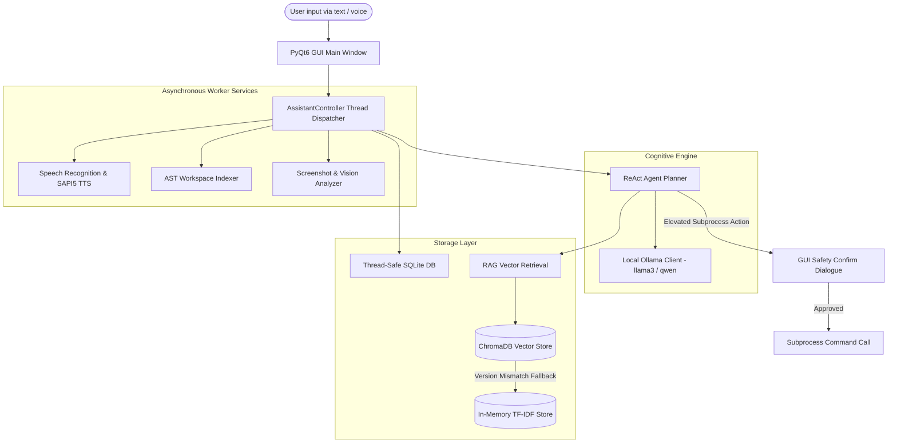

# ⚡ Futurix Jarvis — Safety-Bounded Local AI Desktop Assistant

**Futurix Jarvis** is an offline-first, safety-bounded AI desktop assistant designed for Windows. Built with Python and PyQt6, it integrates local LLM orchestration (via Ollama), semantic document indexing (RAG), voice automation, screen-capture diagnostics, and developer workspace intelligence into a dark futuristic theme.

> **Tagline**: An offline-first, safety-bounded AI desktop assistant combining semantic RAG, voice automation, AST-based workspace intelligence, and vision diagnostics.

---

## 📸 Screenshots

*Below are visual showcases of Futurix Jarvis in action (placeholders for release assets):*

| Main Chat Panel | Elevated Safety Consent | Task Management Widget |
|:---:|:---:|:---:|
|  |  |  |
| *Chat interface featuring neon aesthetics, scrolling message bubbles, and sidebar conversation histories.* | *Inline popup warning card requiring manual user approval before running elevated shell commands.* | *Task checklist detailing priority-indexed action items, due dates, linked files, and notes.* |

---

## 🏗️ Technical Architecture

Jarvis utilizes an event-driven asynchronous structure. Worker actions are dispatched from the PyQt6 main thread to background worker threads to keep the UI fluid and responsive (60fps).



---

## ⚖️ Feature Comparison

| Architectural Feature | Futurix Jarvis (Local Integration) | Cloud-Based Assistant Alternatives |
| :--- | :---: | :---: |
| **Data Privacy** | 🔒 **100% Private** (All data stays local) | ⚠️ **Telemetry Shared** (External APIs) |
| **Offline Capability** | 📶 **Fully Offline** (Runs without internet) | ❌ **Requires Active Internet Connection** |
| **Vector Search Fallback** | 🔄 **Automatic** (ChromaDB ↔ In-Memory TF-IDF) | ❌ **Crash on DB Server Outage** |
| **Workspace AST Indexing** | 💻 **Built-in** (Extracts classes & imports) | ⚠️ **Requires Cloud Repository Access** |
| **Elevated Automation Safety**| 🛑 **GUI Interactive Popups** (User-bounded) | ❌ **Arbitrary commands execute unchecked** |
| **Memory Storage Engine** | 🗄️ **Thread-safe SQLite** (WAL mode enabled) | ☁️ **Stored in Proprietary Cloud Silos** |

---

## 🚀 Installation Guide

### Prerequisites
- **Windows OS**
- **Python 3.12+** — [Download Python](https://www.python.org/downloads/)
- **Ollama** — [Download Ollama](https://ollama.com/download)
- **Git** (optional, for code repo automation features)

### Step-by-Step Setup

1. **Clone the Repository**
   ```cmd
   git clone https://github.com/futurix/futurix_jarvis.git
   cd futurix_jarvis
   ```

2. **Create a Virtual Environment**
   ```cmd
   python -m venv .venv
   .venv\Scripts\activate
   ```

3. **Install Dependencies**
   ```cmd
   pip install -r requirements.txt
   ```
   > ⚠️ **PyAudio Windows Installation Troubleshooting:**
   > If `pip install pyaudio` fails due to missing C++ compilation tools, run:
   > `pip install pipwin` and `pipwin install pyaudio`
   > Alternatively, download the pre-compiled binary wheel file (`.whl`) matching your Python version from official binary mirrors and install it directly:
   > `pip install [wheel-name].whl`

4. **Initialize Ollama and Fetch Models**
   Ensure Ollama is running in your taskbar, then run:
   ```cmd
   ollama pull llama3              # Main ReAct Orchestrator model
   ollama pull nomic-embed-text    # RAG Embeddings model
   ollama pull llava               # Vision screenshot model (optional)
   ```

5. **Initialize Environment Variables**
   ```cmd
   copy .env.example .env
   ```
   *(The default configurations in `.env` are pre-tuned for local execution).*

6. **Run the Assistant**
   ```cmd
   python main.py
   ```

---

## 🎯 Quick Start Guide

### Conversation & Interface
- **Text Command**: Type your query into the bottom input panel and press **Enter** (e.g. *"Show my system RAM usage"*).
- **Voice Activation**: Press **Ctrl+Space** or click the **🎤 Neon Mic Button** to speak. Say *"Hey Jarvis"* to wake up the listener, speak your command, and click the mic again to process.
- **Model Selector**: Switch between different local Ollama models instantly using the dropdown menu in the GUI top header.

### Primary Voice / Text Actions
- **Desktop Automation**: *"Open Notepad"* or *"Launch Chrome"*.
- **System Control**: *"Close Calculator"* or *"Show CPU metrics"*.
- **Workspace Indexing**: *"Index directory C:\Users\user\Projects\my-code"*
- **Codebase QA**: *"Find where classes are defined in the workspace index"*
- **RAG Document Search**: Ingest text/markdown/PDF files inside `knowledge_base/`, then ask: *"What does section 2.4 say in the handbook?"*
- **Visual Diagnostics**: *"Take a screenshot and explain what is on my screen"*

---

## 🔧 Troubleshooting Guide

### 1. SQLite Version / ChromaDB Error on Launch
- **Symptom**: Startup console shows `RuntimeError: Your system's version of sqlite3 is too old. Chroma requires sqlite3 >= 3.35.0`.
- **Solution**: No action is required. Jarvis automatically catches this error, prints a warning, and falls back to a built-in `InMemoryVectorStore` running TF-IDF, keeping the app functional. To enable ChromaDB, replace `sqlite3.dll` in your Python's `DLLs/` folder with the latest DLL from [SQLite's official website](https://sqlite.org/download.html).

### 2. Ollama Connection Refused / Offline Mode
- **Symptom**: Console prints `ConnectionRefusedError: Failed to connect to Ollama`.
- **Solution**: Check your Windows taskbar to verify the Ollama service is active. If running in containers, ensure port `11434` is bound. When offline, Jarvis routes basic tools through regex matchers.

### 3. High DPI Screen-Capture Click Offset
- **Symptom**: Clicking via automation commands clicks slightly offset from the target.
- **Solution**: Go to Windows Settings -> Display -> Scale. If set to 125% or 150%, coordinates passed to pyautogui must be normalized by dividing the raw coordinate by `(scaling_factor / 100)`.

### 4. Poor Performance or Heavy Sluggishness
- **Symptom**: Long wait times before tokens begin streaming.
- **Solution**: Jarvis relies on local GPU acceleration. If Ollama runs on CPU-only modes, loading models (e.g. 4.7GB llama3) takes time. Switch to smaller models such as `qwen2.5:1.5b` or `qwen2.5:3b` in the `.env` settings.

---

## 🗺️ Release Roadmap

- [x] **Phase 1: Foundation & GUI Core**
  - Thread-safe SQLite databases, PyQt6 dark neon stylesheet styling, and speech recognition pipelines.
- [x] **Phase 2: Semantic Document Search (RAG)**
  - `VectorStoreInterface` implementation, ChromaDB native indexing, `nomic-embed-text` embeddings, and zero-dependency in-memory fallbacks.
- [x] **Phase 3: Workspace Intelligence & Vision**
  - AST-based symbol parsers, `llava` local screenshot diagnostics, and prioritized tasks memory checklists.
- [ ] **Phase 4: Multi-Agent Collaboration & Browser Control**
  - Dynamic multi-agent planning, Playwright browser automation tool integrations, and full SAPI5 offline voice stream cancellation upgrades.

---

## 📝 License

This project is released under the **MIT License**. See the [LICENSE.md](file:///c:/Users/user/.gemini/antigravity-ide/scratch/futurix_jarvis/LICENSE.md) file for standard copyright permissions and PyQt6 GPLv3 binary compliance disclaimers.
